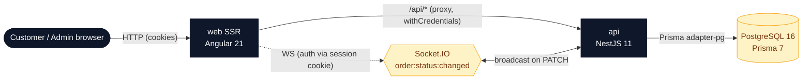

# oishi-sushi

> A modern Angular 21 + NestJS sushi-ordering portfolio app — built end-to-end in a single overnight autonomous run by Claude Code.

Browse a seasonal menu, drop items in a persistent cart, check out with a deeply-validated reactive form, and watch the order status flip in real time over a WebSocket. An admin can manage the catalogue from a separate panel; new meals appear on the public menu without a redeploy.

## Feature checklist

| Area                  | Feature                                                             | Status |
| --------------------- | ------------------------------------------------------------------- | :----: |
| Frontend reactivity   | Angular Signals (computed, effect, linkedSignal, toSignal)          |   ✓    |
| Server-side rendering | SSR + client hydration with event replay                            |   ✓    |
| Lazy loading          | `@defer (on viewport)` for menu cards                               |   ✓    |
| New control flow      | `@if`, `@for`, `@empty`, `@switch` throughout                       |   ✓    |
| Zoneless              | `provideZonelessChangeDetection()`                                  |   ✓    |
| State management      | NgRx SignalStore (cart, admin meals)                                |   ✓    |
| Forms                 | Reactive Forms with `FormArray` + custom cross-field validators     |   ✓    |
| Realtime              | Socket.IO bidirectional channel for order status updates            |   ✓    |
| Routing               | Resolvers, route guards, `withComponentInputBinding`                |   ✓    |
| HTTP                  | Functional interceptors (auth + global error handling)              |   ✓    |
| Auth                  | Passport JWT in httpOnly cookies, role-based RBAC                   |   ✓    |
| Backend               | NestJS 11 modules (auth, menu, orders) + Prisma 7 (pg adapter)      |   ✓    |
| Database              | PostgreSQL 16 with seeded categories, meals, and demo users         |   ✓    |
| Workspace             | Nx 22 monorepo (pnpm), shared `@org/shared-types` and `@org/ui-kit` |   ✓    |
| Testing               | TDD throughout: Jest (unit) + Playwright (e2e, chromium)            |   ✓    |
| Tooling               | Husky + lint-staged pre-commit gate, ESLint, Prettier               |   ✓    |

## Architecture



## Tech stack

- **Frontend** — Angular 21 (standalone components, Signals, SSR), Tailwind CSS 3, NgRx SignalStore, socket.io-client
- **Backend** — NestJS 11, Passport JWT (httpOnly cookies + CSRF token), Socket.IO 4
- **Data** — PostgreSQL 16, Prisma 7 with `@prisma/adapter-pg`
- **Workspace** — Nx 22 (pnpm), shared libs `@org/shared-types`, `@org/ui-kit`
- **Quality** — Jest (unit), Playwright (e2e), ESLint, Prettier, Husky + lint-staged
- **CI** — GitHub Actions (lint + typecheck + test + build + e2e)

## Quick start

```bash
docker compose up -d            # postgres
pnpm install
pnpm prisma migrate deploy
pnpm db:seed                    # 2 users, 3 categories, 6 meals
pnpm nx run @org/api:serve &    # http://localhost:3000/api
pnpm nx run web:serve-ssr       # http://localhost:4000
# or for the dev experience:
# pnpm nx run web:serve         # http://localhost:4200 with HMR
```

Open <http://localhost:4000> (SSR) or <http://localhost:4200> (dev).

## Demo credentials

| Role     | Email                | Password             |
| -------- | -------------------- | -------------------- |
| Admin    | `admin@oishi.dev`    | `demo-admin-pass`    |
| Customer | `customer@oishi.dev` | `demo-customer-pass` |

## Testing

```bash
pnpm nx run-many --target=test --all   # all unit tests (Jest)
pnpm nx e2e web-e2e                    # Playwright end-to-end suite
```

The e2e suite covers three flows:

- `customer-flow.spec.ts` — browse menu → add → cart → checkout → see PENDING
- `admin-flow.spec.ts` — admin login → create meal → meal visible on public menu
- `realtime.spec.ts` — admin status patch reaches the customer's open page in <3 s without a reload

## Screenshots

Capture fresh PNGs into `docs/screenshots/` with the bundled helper (boots services, runs Playwright in headless screenshot mode):

```bash
./scripts/capture-screenshots.sh
```

| Page  | Image                                            |
| ----- | ------------------------------------------------ |
| Menu  |                |
| Cart  |                |
| Admin |  |

## Project layout

```
apps/
  api/         NestJS application
  api-e2e/     API integration tests
  web/         Angular SSR application
  web-e2e/     Playwright end-to-end suite
libs/
  shared-types/  Type contracts shared by api + web
  ui-kit/        Reusable validators + UI primitives
prisma/        Schema + migrations + seed
docs/          Playbook, ADRs, generated screenshots
scripts/       Local dev helpers (services, screenshots)
```

## How this was built

Everything in this repository was generated by an autonomous agent loop driven by `docs/_playbook/_overnight-plan.md`. State machine lives in `STATE.md`; each phase produces 1–2 commits and advances the cursor. ADRs in `docs/_playbook/` document the architectural decisions taken along the way.

## License

MIT — see [LICENSE](LICENSE).
