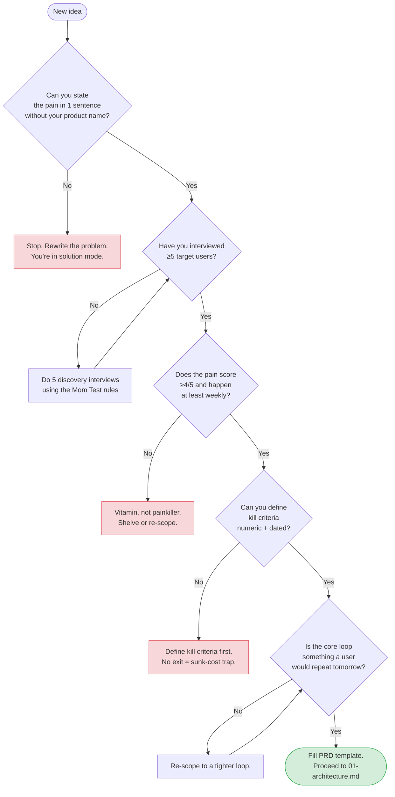

# 00 — Product Vision & Discovery

> **Output of this phase:** a filled [`templates/prd-1pager.md`](./templates/prd-1pager.md) with real interview evidence. No PRD = no project.

## Why this phase exists

Every engineering decision downstream — architecture, DB, auth, hosting — depends on _what_ you're building and _for whom_. Start from the solution and every tradeoff downstream is a coin flip. Start from a validated problem and most decisions make themselves.

The single biggest predictor that a project will fail six months in is skipping this phase.

## Questions to ask yourself

### The problem

- [ ] Can you state the pain in **one sentence** without using your product's name?
- [ ] Is this a _pain_ people already try to solve (with spreadsheets, other tools, duct tape)? What are they using today?
- [ ] How often does this pain happen? Daily / weekly / once-a-year? (Daily is the sweet spot.)
- [ ] On a scale of 1–5, how painful is it? (≤3 → not enough pull.)

### The user

- [ ] One persona, not "everyone". Who specifically?
- [ ] What is their job title, context, and current workaround?
- [ ] Where can you reach 5 of them **this week** to interview?
- [ ] Will they actually pay, adopt for free, or is this a "nice idea" with no buyer?

### The scope

- [ ] What is the _smallest_ experience that would make them come back tomorrow? (That is your core loop.)
- [ ] What features are you _not_ building in V1? (Write them down — out-of-scope is a feature.)
- [ ] What does success look like at **day 30** and **day 90**? Name the metric and the threshold.
- [ ] What would make you **kill** this project? Be specific + numeric + dated.

### The context

- [ ] Why now? What changed (tech, market, regulation, your own leverage) that makes this doable or timely?
- [ ] Who else is solving this? Why will your attempt end differently?
- [ ] What's the biggest unknown that, if wrong, kills it? Can you de-risk it _before_ coding?

## Decision tree

## Template

Copy [`templates/prd-1pager.md`](./templates/prd-1pager.md) → `docs/PRD.md` in your project. Fill every section. If a section is blank, you're not ready.

## Anti-patterns

- **Starting from the solution.** "I want to build an AI agent for X" — wrong direction. Start from the pain, then ask if AI is the right shape of the solution.
- **"Everyone is my user."** Pick one persona. You can expand later. "Everyone" means "no one".
- **No kill criteria.** You _will_ hit the sunk-cost trap without them. Write them before the excitement fades.
- **Interviews that pitch.** Asking "would you use a tool that does X?" gets polite lies. Ask about past behavior: "The last time you did X, what happened?"
- **Skipping discovery because "it's obvious."** It isn't. The feature you think they want is usually 40% right and 60% wrong.

## Worked example — DocQ

> _DocQ: an AI Q&A SaaS over user-uploaded PDFs._

- **Pain (1 sentence):** "Knowledge workers waste 20+ min searching inside long PDFs for facts they know are there."
- **Persona:** mid-career consultants preparing client decks, 30–45yo, already pay for ChatGPT Plus.
- **Pain score / freq:** 4/5, daily.
- **Core loop:** upload PDF → ask a question → get an answer with source citation → copy citation into deck.
- **Out of scope V1:** team workspaces, non-PDF formats, web scraping, fine-tuned custom models.
- **Day-30 metric:** 30% of signups complete ≥3 Q&A loops in week 1.
- **Kill criterion:** if by day 60 fewer than 50 self-serve signups convert to ≥1 loop, stop.
- **Why now:** GPT-class models + cheap vector DBs made sub-$1-per-user economics possible in 2025.

## Next step

→ [01 — Architecture & system design](./01-architecture.md)
