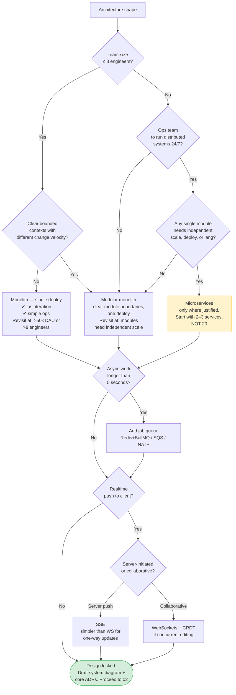
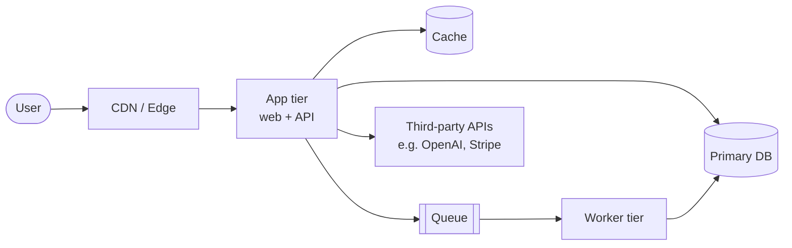

# 01 — Architecture & System Design

> **Output of this phase:** the _shape_ of the system (monolith vs modular vs micro), the main components and how they talk, and 1–3 ADRs for the big structural choices.

## Why this phase exists

You cannot pick a backend framework or a database without knowing the _shape_ of the system: how many services, which ones need independent scale, which talk sync vs async, where data lives, which parts change fastest. Skipping this makes the stack choice an aesthetic one.

**Rule of thumb:** design the architecture that fits _Year-1_ requirements, with named _revisit triggers_ for when to split/scale.

## Questions to ask yourself

### Traffic & scale

- [ ] Day-1 active users? Month-3? Year-1?
- [ ] Reads per second peak? Writes per second peak?
- [ ] Is traffic read-heavy or write-heavy? (It matters — caching vs queue design.)
- [ ] Single region or multi-region?

### Nature of work

- [ ] Is this sync request/response, async job processing, streaming, or a mix?
- [ ] Real-time requirements? (<100ms response, push updates, live collaboration?)
- [ ] Long-running background tasks? (ML inference, scraping, report generation?)
- [ ] Does the system need to process _events_ from elsewhere (webhooks, message queues)?

### Data gravity

- [ ] Where does the data actually live? Who owns it?
- [ ] How does data flow in and out? (Files, APIs, events, user input?)
- [ ] Is there a "single source of truth" entity, or is data scattered by design?

### Tenancy & boundaries

- [ ] Single-tenant, pooled multi-tenant, or silo-per-tenant?
- [ ] Which modules change together? Which change independently? (Modules that change together = service boundary candidate.)
- [ ] Which parts of the system have the highest change velocity (iteration speed matters)?

### Integrations

- [ ] Third-party systems you must talk to (Stripe, OpenAI, Twilio, legacy CRM)?
- [ ] Sync or async integration? Do they rate-limit you? Do they go down?
- [ ] Who owns the contract when they change their API?

### Constraints

- [ ] Compliance zone (PII / GDPR / HIPAA / SOC2)?
- [ ] Latency SLA per user-facing path?
- [ ] Budget envelope for infra at Year-1 scale?
- [ ] Team size and ops maturity?

## Decision tree

**Rule:** microservices require paying a distributed-systems tax (tracing, service discovery, deployment coordination, data consistency). Only pay it when the benefit is real — different scaling profile, different language needs, different change cadence, different teams.

## C4-lite context + container sketch

Every project gets at minimum:

Customize boxes for your system. If your sketch has >7 containers on day 1, you are probably over-designing.

## Template

Use [`templates/adr.md`](./templates/adr.md) to record the structural decisions:

- ADR-0001: Monolith vs modular vs microservices
- ADR-0002: Sync vs async processing model
- ADR-0003: Realtime delivery mechanism (if applicable)

## Anti-patterns

- **Microservices on day 1.** You're paying distributed-systems overhead for team coordination you don't have and scale you don't need. Default to modular monolith.
- **"We'll scale it later" without numbers.** Know the wall: "This breaks at ~X users or ~Y QPS. Revisit trigger: we hit 50% of X."
- **No module boundaries in a monolith.** A monolith isn't an excuse for spaghetti — enforce module boundaries with folders, interfaces, or a tool like dependency-cruiser/Nx.
- **Realtime everywhere.** WebSockets for "real-time feel" where polling every 30s would do. Pay the cost only where the UX demands it.
- **Ignoring data gravity.** Putting the service in AWS us-east while the main data source is Azure EU = expensive and slow. Let the data tell you where compute lives.

## Worked example — DocQ

- **Scale Year-1:** 5k DAU, ≤30 QPS read, ≤5 QPS write. → _Monolith fits._
- **Nature of work:** ingest = long (embed PDFs, can take 60s+) → **async queue**. Q&A = sync, ≤3s budget → **direct request/response**.
- **Shape:** modular monolith (Next.js) + a worker tier (Node or Python) for ingestion.
- **Realtime:** not needed V1. Polling is fine for ingestion progress.
- **Revisit trigger:** split ingestion worker into own service if embedding cost/concurrency ever dominates infra bill.

## Next step

→ [02 — Backend stack decision](./02-backend-stack.md)
