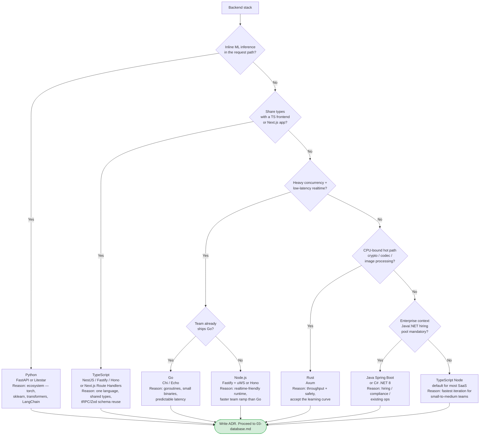

# 02 — Backend Stack Decision

> **Output of this phase:** an ADR naming the language, runtime, and framework for the backend, with the options considered and the ONE reason that dominated the choice.

## Why this phase exists

The backend stack is one of the two or three most expensive decisions in the project's life. It dictates hiring, ecosystem, latency ceiling, and how pleasant iteration feels. Picking by familiarity alone is fine _only if_ familiarity is the dominating constraint (tiny team, short horizon). Otherwise be deliberate.

## Questions to ask yourself

### Team & hiring

- [ ] What language does the team already ship in confidently?
- [ ] What's the hiring pool look like locally/remotely for each candidate language?
- [ ] Does your future hiring target a specific ecosystem (data scientists → Python, mobile devs → Kotlin/Swift, enterprise → Java/.NET)?

### Workload profile

- [ ] Is there **inline ML inference** in the request path? (If yes → Python is a natural fit; otherwise call a separate inference service.)
- [ ] High-concurrency real-time (chat, presence, live data)? (Node, Go, Elixir shine.)
- [ ] CPU-bound work per request (image processing, crypto, heavy parsing)? (Go, Rust, C++ win.)
- [ ] Primarily CRUD + integrations? (Any mature stack works; go with team skill.)

### Latency & throughput

- [ ] p95 latency budget per user-facing endpoint?
- [ ] QPS target at Year-1? 10k+? Hundreds? (The answer rules out almost nothing at Year-1.)
- [ ] Cold-start tolerance? (Rules in/out serverless for certain runtimes.)

### Ecosystem fit

- [ ] Do you need a specific library that only exists in one ecosystem? (e.g., LangChain-Python vs LangChain-JS — both exist but maturity differs.)
- [ ] Which ORM/query builder / background-job / observability libs do you want, and where are they best?

### Typing & DX

- [ ] Do you want strong static typing? (TS, Go, Rust, Java, C#, Kotlin — yes. Python/Ruby/JS — opt-in or bolted-on.)
- [ ] How much code do you want to share between frontend and backend? (TS monorepo = huge win for internal apps.)

### Deployment target

- [ ] Long-running servers (Fly/Render/ECS)?
- [ ] Serverless (Vercel/Lambda)? (Node, Python, Go fine; JVM less ideal.)
- [ ] Edge runtime (Cloudflare Workers, Vercel Edge)? (JS/WASM only.)

## Decision tree

## Reference cheat sheet

| Pick                                    | Strongest when                                                | Avoid when                                                              |
| --------------------------------------- | ------------------------------------------------------------- | ----------------------------------------------------------------------- |
| **Python + FastAPI**                    | ML in the request path, data-heavy pipelines, scientific libs | Heavy concurrency, ultra-low-latency APIs, type-heavy enterprise        |
| **TypeScript + NestJS / Fastify**       | Full-stack TS, schema-sharing, SaaS iteration speed           | CPU-bound work, need predictable 10ms p99                               |
| **TypeScript + Next.js Route Handlers** | Small-medium SaaS, edge-friendly, one-language stack          | Complex domain logic begging for a dedicated API, heavy background jobs |
| **Go + Chi/Echo**                       | Realtime, infra tools, CLIs, predictable latency              | Rapid-iteration SaaS where team doesn't know Go yet                     |
| **Rust + Axum**                         | Throughput, correctness, systems code                         | You need to ship fast with a small team; Rust tax is real               |
| **Java Spring Boot / .NET**             | Enterprise, compliance, existing ecosystem + hiring           | Small startup speed; ops weight high for the problem                    |
| **Elixir + Phoenix**                    | Realtime at scale, LiveView, fault-tolerance                  | Hiring pool, niche ecosystem                                            |

## Template

Fill [`templates/adr.md`](./templates/adr.md) as `docs/adr/0004-backend-stack.md`:

- Options considered: ≥3.
- Decision: one pick + the ONE reason that tipped it.
- Revisit trigger: e.g., "if we need inline ML inference, revisit Python side-service."

## Anti-patterns

- **Trend-driven picks.** Rust/Elixir/Deno/Bun are all great — pick them for a real reason, not because HN cheered.
- **Ignoring team skill.** A "better" stack your team doesn't know will be slower in practice for the first 6 months.
- **Polyglot by default.** Two languages = two deploy pipelines, two on-call runbooks, two dependency audits. Justify each language you add.
- **Picking the framework before the language.** Decide language first from workload + team, then the framework.
- **Optimizing for scale you don't have.** You don't need Rust for a 100 QPS SaaS.

## Worked example — DocQ

- Inline ML? **No** — we call OpenAI over HTTP; embedding is in a worker, not the request path.
- Share types with Next.js frontend? **Yes** — Next.js App Router with Zod schemas.
- Heavy concurrency? No, ~30 QPS at Year-1.
- → **Pick: TypeScript, Next.js Route Handlers + a Node.js worker (BullMQ) for ingestion.**
- **ADR revisit trigger:** split ingestion into a Python FastAPI service if we start running open-source embedding models locally.

## Next step

→ [03 — Database selection](./03-database.md)
