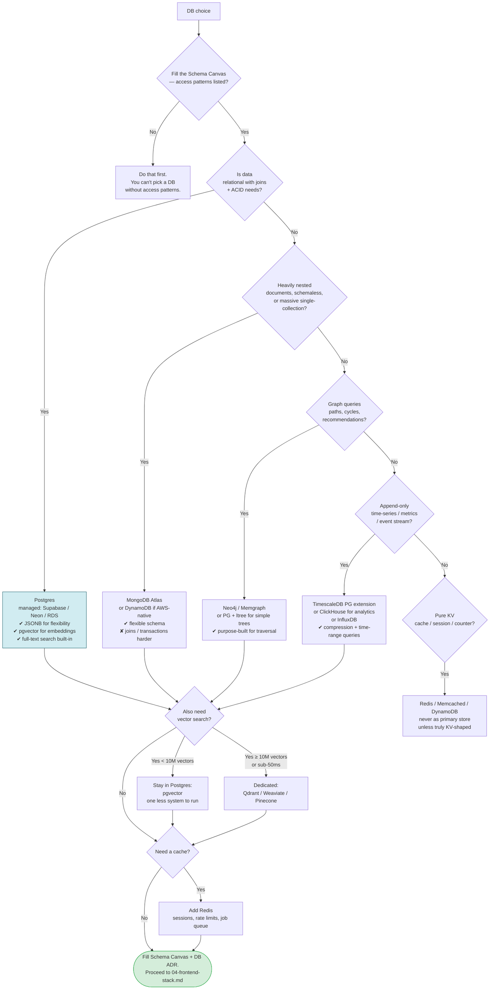

# 03 — Database Selection

> **Output of this phase:** a filled [`templates/schema-canvas.md`](./templates/schema-canvas.md) and an ADR naming the primary store plus any specialist stores.

## Why this phase exists

Database is the single hardest decision to reverse. Migrating later costs weeks to months of real engineering time and risk. Think in **access patterns** first, not tables — the queries your app will actually run drive the choice.

**Default mantra:** _Postgres first. Add a specialist store (vector, time-series, graph, cache) only when an access pattern demands it._ Postgres handles relational + JSON + full-text + vector (pgvector) + queue (LISTEN/NOTIFY) well enough to be the single store for most projects under 10M rows.

## Questions to ask yourself

### Data shape

- [ ] Is the data primarily **relational** (entities with foreign keys, joins)?
- [ ] Primarily **document** (nested JSON, variable schema per record)?
- [ ] Primarily **graph** (many-to-many with path queries)?
- [ ] **Vector** (embeddings for similarity search)?
- [ ] **Time-series** (metrics, events, append-only by timestamp)?
- [ ] **Key-value** (simple get/set, cache-like)?

### Access patterns (fill the canvas before picking)

- [ ] For each query your app actually runs: Is it by primary key? By secondary index? Full-text? Nearest-neighbor? Range scan? Aggregation?
- [ ] Read-heavy or write-heavy per pattern?
- [ ] Latency budget per pattern (<10ms cache? <200ms search? <1s analytics?)
- [ ] Concurrency: how many clients writing the same row?

### Consistency & transactions

- [ ] Do you need **multi-row transactions**? (Most SaaS: yes.)
- [ ] Strong read-after-write consistency, or is eventual OK?
- [ ] Any global-scale requirement that forces eventual (multi-region active-active)?

### Scale & cost

- [ ] Rows at Year-1? Storage at Year-1? (Capacity-plan table in the canvas.)
- [ ] QPS peak read and write?
- [ ] Budget envelope — managed ($$) vs self-hosted ($) vs serverless ($$$ at scale)?
- [ ] Multi-region: need it V1? (Usually no.)

### Operational

- [ ] Backup + PITR requirements?
- [ ] Who runs it — managed service (RDS, Supabase, Neon, Planetscale, Mongo Atlas) or self-host?
- [ ] Team familiarity with the engine?

## Decision tree

## Reference cheat sheet

| Shape                      | Default pick                                                                                      | When to go specialist                             |
| -------------------------- | ------------------------------------------------------------------------------------------------- | ------------------------------------------------- |
| Relational + ACID          | **Postgres (managed)**                                                                            | Never without a strong reason                     |
| Document / flexible schema | Postgres + JSONB                                                                                  | True scale-out needed → Mongo/DynamoDB            |
| Vector / similarity        | pgvector in Postgres                                                                              | >10M vectors OR <50ms p95 → Qdrant/Pinecone       |
| Time-series / metrics      | TimescaleDB (PG ext.)                                                                             | Analytical OLAP scale → ClickHouse                |
| Graph traversal            | PG + recursive CTE / ltree                                                                        | Deep traversal, GraphRAG → Neo4j                  |
| Full-text search           | PG `tsvector`                                                                                     | Complex relevance tuning → OpenSearch/Meilisearch |
| KV / cache / session       | **Redis**                                                                                         | Need persistence + complex indexing → back to PG  |
| Analytics / reporting      | Ship raw data to a warehouse (BigQuery / Snowflake / DuckDB) — don't query prod PG for dashboards |

## Template

Fill [`templates/schema-canvas.md`](./templates/schema-canvas.md) → `docs/schema-canvas.md`.
Write the DB ADR: [`templates/adr.md`](./templates/adr.md) → `docs/adr/0005-database.md`.

## Anti-patterns

- **Mongo to avoid migrations.** You still need migrations — just undocumented ones. And you lose joins + ACID. Be honest about data shape.
- **Skipping pgvector** because "vector DBs are a separate thing" — for <10M vectors it's strictly better to stay in Postgres.
- **Using your primary DB as a queue.** Fine for small scale (LISTEN/NOTIFY, pg_cron) but don't build SQS on top of it.
- **Running analytics on production PG.** Long queries block your OLTP. Ship to a warehouse (BigQuery/Snowflake) or at minimum a read replica.
- **No capacity math.** "Probably fits" ≠ a plan. Write rows × avg size × growth for Year-1 and Year-2.
- **Multi-region day 1.** Single-region is the right V1 for 99% of products.

## Worked example — DocQ

Access patterns (from the canvas):

1. Fetch user by id — R, very high, <10ms → relational index.
2. List user's docs — R, high, <100ms → relational + secondary index.
3. Vector-search top-k chunks for a user — R, high, <200ms p95 → vector, ~1–5M vectors Year-1.
4. Append doc + chunks + embeddings — W, medium → transactional, all-or-nothing.

→ **Pick: Postgres (Supabase) with pgvector + Redis for rate limits and ingestion queue (BullMQ).**

Revisit triggers:

- If we exceed 10M embeddings or p95 > 200ms, migrate vectors to Qdrant.
- If analytics become heavy, add BigQuery via CDC (e.g., PeerDB / Fivetran).

## Next step

→ [04 — Frontend stack decision](./04-frontend-stack.md)
