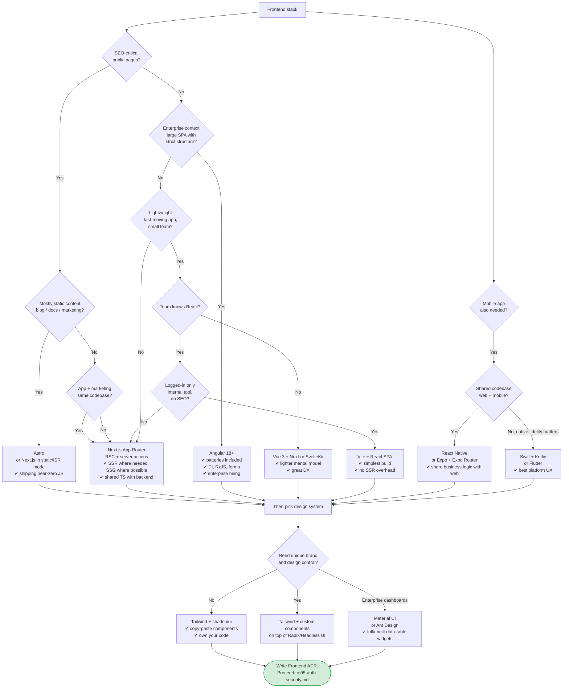

# 04 — Frontend Stack Decision

> **Output of this phase:** an ADR naming the frontend framework, rendering strategy, and design system.

## Why this phase exists

Frontend choice drives SEO, TTI, and how much control you have over content. It also drives hiring and which backend integration style is ergonomic (server components, tRPC, REST, GraphQL).

Two orthogonal decisions get made here:

1. **Framework + rendering strategy** (SSR / SSG / SPA / MPA).
2. **Design system** (Tailwind + shadcn / Material / Ant / custom).

## Questions to ask yourself

### Content & SEO

- [ ] Does SEO matter for the main entry points? (Marketing pages, blog, product pages — yes. Internal tool — no.)
- [ ] Is content mostly static and pre-buildable, or heavily personalized?
- [ ] Do users come in logged-out or logged-in first?

### Interactivity

- [ ] Is the app mostly forms + tables (CRUD) or a rich editor / real-time dashboard / canvas?
- [ ] Offline / PWA requirements?
- [ ] Keyboard-heavy power-user tool?

### Platforms

- [ ] Web only? Also mobile apps? Desktop?
- [ ] Shared codebase across web + mobile needed?

### Team & integration

- [ ] Team's strongest frontend framework?
- [ ] Backend language — full-stack TS advantage? (Next.js + tRPC for single-language repo.)
- [ ] API style — REST, GraphQL, tRPC, server actions?

### Performance budget

- [ ] Largest Contentful Paint target on a slow 4G mobile?
- [ ] Bundle-size budget?
- [ ] Cold-start tolerance per route?

## Decision tree

## Reference cheat sheet

| Pick                    | Strongest when                                               | Avoid when                                                 |
| ----------------------- | ------------------------------------------------------------ | ---------------------------------------------------------- |
| **Next.js App Router**  | SaaS with mix of marketing + app, SEO matters, full-stack TS | You don't need SSR and want simplest build                 |
| **Astro**               | Content-heavy sites, blogs, docs, marketing                  | Highly interactive apps                                    |
| **Angular**             | Enterprise SPA, large team, strong opinions valued           | Tiny team, fast prototyping                                |
| **Vue / Nuxt**          | Lighter than React, great DX, strong conventions             | Hiring pool smaller than React in some markets             |
| **SvelteKit**           | Small bundles, small team, performance-sensitive             | Rare hires, ecosystem smaller                              |
| **Vite + React SPA**    | Pure internal tools, no SEO, no SSR complexity               | Public sites, SEO-critical                                 |
| **React Native / Expo** | Share logic with web, faster ship                            | Need truly native feel / heavy graphics                    |
| **Flutter**             | Consistent look across iOS+Android, custom UI                | You want web + mobile from one codebase                    |
| **Tailwind + shadcn**   | Full control, copy code, modern stack                        | You need pre-built data tables, charts, enterprise widgets |
| **Material / Ant**      | Admin dashboards, instant widgets                            | Brand-unique marketing, custom design                      |

## Template

[`templates/adr.md`](./templates/adr.md) → `docs/adr/0006-frontend-stack.md` — include:

- Rendering strategy per route (SSG / SSR / ISR / CSR).
- Design system choice.
- State management (React Query + Zustand / Redux Toolkit / Pinia / NgRx).

## Anti-patterns

- **SPA for a content site.** You throw away SEO + TTI for no UX benefit.
- **SSR on every route** when most are static or logged-in only. Be precise per route.
- **Rebuilding a design system from scratch.** shadcn/Material/Ant solve 80% out of the box.
- **Picking a framework your team doesn't know for greenfield speed.** First 3 months will be slower, not faster.
- **React everywhere reflex.** Vue/Svelte/Astro may literally be better per-case — evaluate.
- **Server components + REST API.** Use server actions or tRPC for the ergonomic win.
- **Heavy state library for simple apps.** React Query + a handful of Zustand stores covers most SaaS.

## Worked example — DocQ

- SEO-critical public pages (marketing, docs): **yes**.
- App + marketing same codebase: **yes**.
- Logged-in app has forms + chat UI + doc preview, not a heavy editor.
- Team: TS + React.
- → **Pick: Next.js App Router with ISR for marketing, RSC + server actions for the logged-in app. Tailwind + shadcn/ui. React Query for async state, Zustand for lightweight UI state.**

No mobile app V1. Revisit trigger: if mobile retention need is clear, ship Expo using shared `@docq/core` TS package.

## Next step

→ [05 — Auth, security, compliance](./05-auth-security.md)
