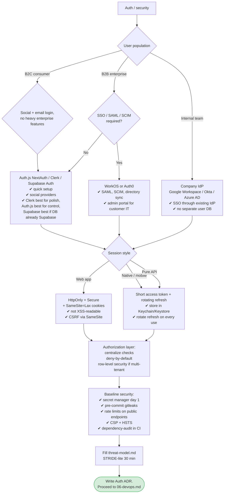

# 05 — Auth, Security, Compliance

> **Output of this phase:** an Auth ADR + a filled [`templates/threat-model.md`](./templates/threat-model.md) covering the top 6–8 risks.

## Why this phase exists

Auth and baseline security are trivially easy to get wrong in ways that aren't visible until someone exploits them. Most "AuthN outages" or breaches trace back to decisions made in week 1 without a deliberate threat model. Do this before coding, not after.

**Rule of thumb:** do NOT roll your own auth. Use a proven library (Auth.js, Lucia, Supabase Auth, Clerk, Auth0, WorkOS).

## Questions to ask yourself

### Identity

- [ ] Users: internal (team) / external consumer (B2C) / external enterprise (B2B)?
- [ ] SSO required? SAML? SCIM for provisioning?
- [ ] Social login (Google, Apple, GitHub)? Magic link? Email + password?
- [ ] MFA — required, optional, or WebAuthn-native from day 1?
- [ ] Password reset flow — email-based? Passwordless entirely?

### Sessions & tokens

- [ ] Web app — session cookies (HttpOnly, SameSite=Lax, Secure) are the default. Don't reach for JWT without reason.
- [ ] API-only — short-TTL access token + refresh token (rotating).
- [ ] Mobile — refresh tokens in secure storage, short access tokens.
- [ ] Idle + absolute session lifetimes?

### Authorization

- [ ] Role model — RBAC (admin/member/viewer)? ABAC (per-field attribute checks)?
- [ ] Multi-tenant — how do you guarantee tenant isolation on every query? (Row-level security in PG is the strongest default.)
- [ ] Admin impersonation — allowed? Audited?
- [ ] Who can escalate privileges, and through what audited flow?

### Data sensitivity

- [ ] PII collected (email, name, phone, address, IP)?
- [ ] Regulated data (health, financial, kids' data)?
- [ ] Region of users (EU → GDPR, California → CCPA)?
- [ ] Data retention defaults — can a user delete their account and have data purged?

### Threats to rank

- [ ] Account takeover
- [ ] Privilege escalation / tenant bleed
- [ ] Data exfiltration (API scraping, overly broad queries)
- [ ] Secret leakage (logs, error pages, frontend bundles)
- [ ] Supply chain (compromised npm package)
- [ ] Denial of service (expensive endpoints, AI API cost-drain)

### Secrets management

- [ ] Where are prod secrets stored? Who can read them?
- [ ] Rotation cadence?
- [ ] Pre-commit + pre-push hooks blocking secret commits? (e.g., gitleaks)

## Decision tree

## Reference cheat sheet

| Provider / lib         | Best for                                                   | Cost/friction                         |
| ---------------------- | ---------------------------------------------------------- | ------------------------------------- |
| **Auth.js (NextAuth)** | Next.js app, open-source, full control, free               | You maintain the integration          |
| **Lucia**              | TS projects wanting to own auth fully, small dep footprint | More manual wiring                    |
| **Clerk**              | Polished B2C UX, pre-built UI, fast ship                   | $$ at scale, vendor lock              |
| **Supabase Auth**      | Postgres-native apps, one-service stack                    | Tied to Supabase ecosystem            |
| **WorkOS**             | B2B SaaS needing SSO/SAML/SCIM day 1                       | $$ but saves weeks of enterprise work |
| **Auth0**              | Established B2B/B2C needing breadth                        | $$$ at scale                          |
| **Keycloak**           | Self-hosted enterprise, full control                       | Ops burden                            |

## Template

[`templates/threat-model.md`](./templates/threat-model.md) → `docs/threat-model.md`.
[`templates/adr.md`](./templates/adr.md) → `docs/adr/0007-auth.md`.

## Anti-patterns

- **Rolling your own password hashing / session logic.** Use a library. Always.
- **Storing sessions in `localStorage` / `sessionStorage`.** XSS = instant takeover. Use HttpOnly cookies.
- **Long-lived JWTs as sessions.** Revocation is painful; prefer cookies for web or short access + rotating refresh for mobile.
- **Tenant-scoping enforced at the application layer only.** One missing `where tenant_id = ?` and you bleed data. Use Postgres RLS as a belt-and-suspenders default.
- **Secrets in `.env` committed to the repo.** Even "just dev" — they leak to git history forever.
- **No rate limiting on public endpoints.** AI endpoints especially — a single bad actor can drain your OpenAI budget overnight.
- **Wide CORS (`*`)** because "it was blocking dev." Pin allowed origins.
- **"We'll add MFA later."** Add it before first customer. Retrofitting is painful and risky.
- **Trusting the client** to send `is_admin: true`. Server checks only. Always.

## Worked example — DocQ

- Users: B2C (individual consultants). Social login (Google) + email magic link. No SSO V1.
- Session: **HttpOnly cookies**, SameSite=Lax.
- Tenant: users are single-tenant (no team accounts in V1). All DB rows have `user_id`, enforced by Postgres RLS.
- AI abuse: rate-limit /ask endpoint at 60 rpm per user + 1000 rpd per user hard ceiling. Alert if daily OpenAI spend exceeds budget.
- Data: documents are PII in the sense that user-uploaded; delete-account flow must hard-delete docs + embeddings within 30 days.
- → **Pick: Auth.js with Google + Email magic link. Postgres RLS for tenant enforcement. Secrets in Vercel env + Doppler. Gitleaks pre-commit.**

## Next step

→ [06 — DevOps & deployment](./06-devops.md)
