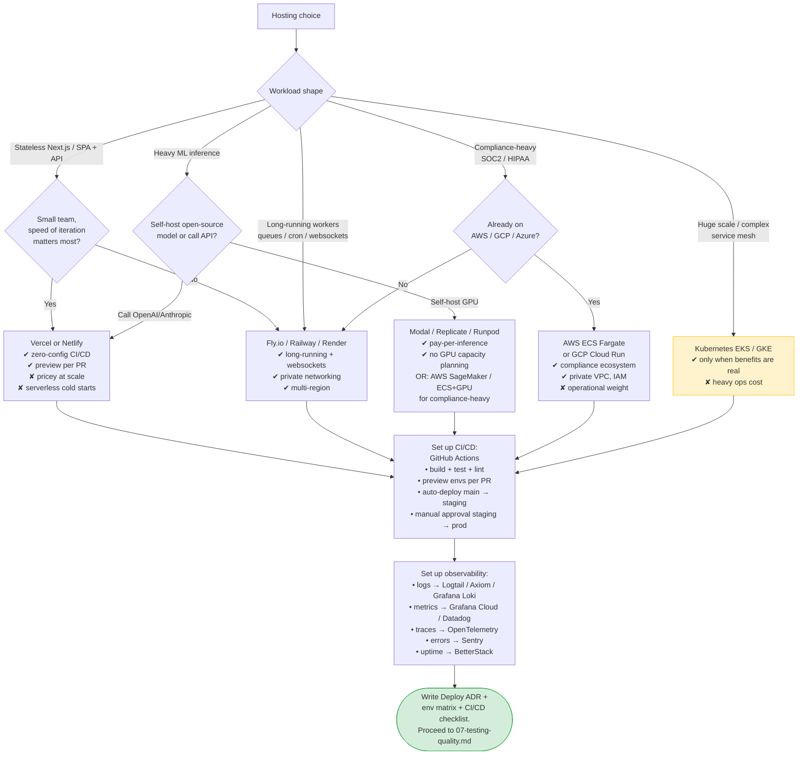

# 06 — DevOps & Deployment

> **Output of this phase:** a deployment ADR, an env matrix, a CI/CD checklist, and an observability plan — committed to the repo as `docs/deploy.md` + ADR.

## Why this phase exists

Most teams decide hosting last, rushed, "what's easiest to deploy to." This leads to lock-in, surprise bills, or inability to pass compliance. Decide deliberately while you still have options.

**Rule of thumb:** pick the simplest hosting that meets Year-1 requirements. You can move. You will not, if the cost is low enough.

## Questions to ask yourself

### Traffic & geo

- [ ] Geographic distribution of users? (One region or global?)
- [ ] Peak traffic day 1 / year 1?
- [ ] Tolerance for cold starts on the user's first request?

### Workload shape

- [ ] Stateless web + API (fits any PaaS)?
- [ ] Long-running workers, queues, cron?
- [ ] WebSockets / SSE (needs persistent connections)?
- [ ] Heavy ML inference (GPU? specialized runtime?)?
- [ ] Stateful services (self-managed DB, Kafka)?

### Team capacity

- [ ] Ops skill level — is there a person who'll carry pager?
- [ ] Time budget — hours/week you can spend on infra?
- [ ] Compliance — SOC2 / HIPAA / PCI scope?

### Cost

- [ ] Monthly infra budget at V1?
- [ ] What does cost look like at 10× scale?
- [ ] Vendor lock-in tolerance?

### Lifecycle

- [ ] CI/CD — how fast do you want code → prod? (Under 10 min is a worthwhile target.)
- [ ] Environments — prod only, or dev + staging + prod? (At least staging, almost always.)
- [ ] Preview environments per PR?

### Observability

- [ ] What logs do you need searchable?
- [ ] What metrics alert on-call?
- [ ] Tracing — distributed tracing via OpenTelemetry from day 1?
- [ ] Error tracking — Sentry or similar?
- [ ] Uptime monitoring — external (e.g., BetterStack)?

## Decision tree

## Env matrix (template)

| Env        | Purpose     | Branch        | Data                  | Secrets                   | Access      |
| ---------- | ----------- | ------------- | --------------------- | ------------------------- | ----------- |
| local      | dev         | per-dev       | seeded                | `.env.local` (gitignored) | dev         |
| preview    | PR preview  | per-PR        | ephemeral, seeded     | injected by hosting       | team        |
| staging    | integration | `main`        | prod-like, anonymized | env vault staging scope   | team        |
| production | live        | `release` tag | real                  | env vault prod scope      | oncall only |

## CI/CD checklist

- [ ] PR CI runs: type-check, lint, unit tests, integration tests, build.
- [ ] PR CI blocks merge on red.
- [ ] Preview env deployed per PR (if PaaS supports it).
- [ ] `main` → staging auto-deploy.
- [ ] Production deploy is a manual approval OR release-tag trigger (never just auto on main).
- [ ] Rollback playbook exists and has been tested once.
- [ ] Migrations run automatically on deploy, with a gate for destructive changes.
- [ ] Secrets never printed in logs.
- [ ] Build time <10 min on main.

## Observability checklist

- [ ] Structured logs (JSON) with request id, user id (when auth'd), tenant id.
- [ ] Key metrics: request rate, error rate, p95/p99 latency per endpoint.
- [ ] Distributed tracing for at least the user-facing critical paths.
- [ ] Error tracking (Sentry) wired with source maps in frontend + backend.
- [ ] Uptime check from an external location.
- [ ] Alerts defined for: 5xx rate spike, p95 > SLA, worker queue backlog, cost anomaly (esp. AI APIs).
- [ ] On-call rotation — at minimum a single number to page.
- [ ] Runbook for each alert: what to check, what to do.

## Template

[`templates/adr.md`](./templates/adr.md) → `docs/adr/0008-hosting.md` + `docs/deploy.md` with env matrix, CI/CD, observability.

## Anti-patterns

- **Kubernetes on day 1.** Unless you _need_ it. Most teams don't.
- **Vercel until it breaks you.** Know the escape hatch (Next.js on Node elsewhere) and the revisit trigger (e.g., compute bill > $3k/mo).
- **No staging.** You will ship bugs to prod that any basic integration run would have caught.
- **Logs-only observability.** Without metrics you can't alert; without traces you can't debug cross-service.
- **Alerts nobody reads.** Tune until every alert is actionable. Alerts → runbooks.
- **Secrets in CI plaintext.** Use the CI secret store. Mask in logs.
- **Deploy any commit to prod.** Use `staging → prod` promotion.
- **No rollback plan.** The worst time to learn the rollback procedure is during an incident.
- **Ignoring AI API cost.** Daily budget alarms from day 1 or you learn the hard way at 3 AM.

## Worked example — DocQ

- Traffic: 5k DAU Year-1, ~30 QPS, single region (US).
- Workload: Next.js app + Node.js ingestion worker (BullMQ).
- Budget: <$500/mo infra V1.
- Ops capacity: 1 founder, no dedicated ops.
- → **Pick: Vercel for Next.js, Fly.io for worker + Redis, Supabase (PG + Auth + Storage) as managed data.**
  - CI: GitHub Actions → preview per PR → auto-staging → manual prod.
  - Observability: Axiom (logs), Sentry (errors), BetterStack (uptime), Grafana Cloud (metrics).
  - OpenAI cost alarm: $25/day hard alert, $50/day hard cutoff.
- Revisit triggers: move Vercel → Fly.io if compute > $2k/mo; split worker to own service if ingestion-concurrency dominates.

## Next step

→ [07 — Testing & quality strategy](./07-testing-quality.md)
