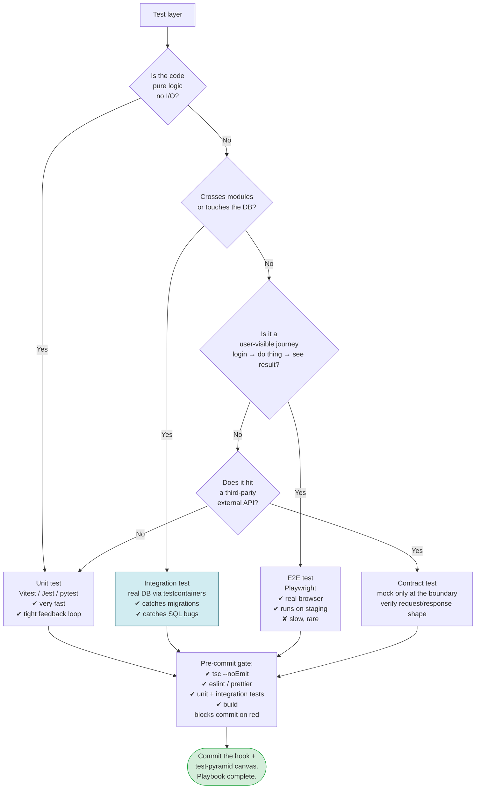

# 07 — Testing & Quality Strategy

> **Output of this phase:** a testing-pyramid decision (percentages per layer + rationale), plus a pre-commit hook configuration committed to the repo.

## Why this phase exists

Tests are design pressure, not paperwork. Decide the shape of the test pyramid _before_ writing code — otherwise you ship either (a) 100% unit tests that pass while prod fails or (b) 5 slow E2E tests you never run locally. Neither protects you.

This phase also fixes the **pre-commit gate** standard for this project: `tsc --noEmit` + lint + tests + build must pass before any commit. No exceptions.

## Questions to ask yourself

### Risk mapping

- [ ] Which modules carry highest _business_ risk if broken? (e.g., billing, auth, data pipelines)
- [ ] Which modules are most _likely to change_? (Need fast regression tests.)
- [ ] Which flows, if broken, lose user trust instantly? (These deserve E2E.)

### Test layers

- [ ] Pure logic / pure functions — **unit tests**, many, fast.
- [ ] Business flow crossing modules — **integration tests** with a real DB (never mocked).
- [ ] User journey end-to-end — **E2E** on staging, few, slow, high-value.
- [ ] UI regressions — visual / snapshot tests only where the UI is stable.

### Test doubles

- [ ] **Real DB** for integration tests — use testcontainers or a throwaway schema. Reason: mocked DB behaves differently from prod; migration bugs slip past.
- [ ] Mock only at true external boundaries (third-party HTTP, payment provider sandbox).
- [ ] Snapshot tests — OK for pure rendering; avoid for anything behavioral.

### Data & fixtures

- [ ] Factories > fixtures (e.g., `@faker-js` + builder fns). Fixtures rot.
- [ ] Seed script for local + CI, deterministic.
- [ ] Test isolation — each test owns its data, no ordering dependency.

### Speed

- [ ] Unit + integration suite target: <60s locally.
- [ ] E2E on CI: <10 min.
- [ ] Flaky test policy: quarantine, not retry-forever.

### Coverage

- [ ] Don't chase a coverage number; target _behavior_ coverage on high-risk paths.
- [ ] Enforce coverage only on critical modules (e.g., billing >90%) via per-directory config.

## Decision tree



## Test pyramid canvas

| Layer                 | % of suite | What it covers                                                 | Where it runs                 | Speed target                    |
| --------------------- | ---------- | -------------------------------------------------------------- | ----------------------------- | ------------------------------- |
| Unit                  | 60–70%     | pure functions, domain logic                                   | locally + CI                  | <1s each, <30s total per module |
| Integration (real DB) | 20–30%     | handlers + DB + real migrations                                | locally + CI (testcontainers) | <10s each, <60s total           |
| E2E                   | 5–10%      | critical user journeys (login, happy-path purchase, core loop) | CI against staging            | <2 min each                     |
| Contract              | few        | third-party boundary schemas                                   | CI                            | fast                            |

**Shape per project type:**

- Pure library: 90% unit, 10% integration.
- CRUD SaaS: 60 / 30 / 10.
- Data pipeline: 40 / 50 / 10 — lean heavy on integration with real data stores.

## Pre-commit hook template

Every project in this workspace follows the standard (per `~/.claude/CLAUDE.md` `feedback_precommit_hook_standard`):

`.husky/pre-commit` (for Node/TS projects):

```bash
#!/usr/bin/env sh
. "$(dirname -- "$0")/_/husky.sh"

set -e

pnpm -r exec tsc --noEmit
pnpm -r lint --max-warnings=0
pnpm -r test --run
pnpm -r build
```

For Python projects, swap in:

```bash
#!/usr/bin/env sh
set -e
ruff check .
ruff format --check .
mypy .
pytest -q
```

## Template

Fill `docs/testing.md` in the project with:

- Per-module risk rating (H/M/L).
- Target pyramid percentages (from the canvas above).
- Which flows are E2E-protected.
- Pre-commit contents.
- How to run the suite locally and in CI.
- Flaky-test policy.

## Anti-patterns

- **Mocking the DB in integration tests.** Mocks lie. The user's own hard rule: integration tests hit a real DB — use testcontainers.
- **100% unit, 0% E2E.** Prod breaks at integration seams you never tested.
- **Snapshot-only tests for behavior.** They pass when the behavior is wrong and fail for irrelevant whitespace.
- **No pre-commit gate.** "I'll run tests before pushing" — no you won't. Enforce at the hook.
- **Skipping pre-commit with `--no-verify`.** Violates the global rule. If the hook fails, fix the code, don't bypass.
- **Chasing coverage %.** 90% coverage of the wrong things = a false sense of safety. Test _behavior_, target _risk_.
- **Retry-until-green flaky tests.** They'll hide real bugs. Quarantine + triage instead.
- **Writing tests after the feature.** TDD's value is design pressure. After-the-fact tests pin down bad designs.

## Worked example — DocQ

Risk map:

- **High:** ingestion pipeline (embedding → chunks → retrieval). Wrong here = Q&A gives wrong answers = trust lost.
- **High:** auth / tenant isolation (users must never see another user's docs).
- **Medium:** billing (but Stripe-hosted checkout, small surface).
- **Low:** marketing pages.

Pyramid:

- 55% unit — chunkers, prompt builders, retrievers.
- 35% integration — ingestion worker + Postgres + pgvector with testcontainers. Tenant-isolation SQL tested explicitly.
- 10% E2E — Playwright: signup → upload PDF → wait for processing → ask question → see citation.

Pre-commit: `tsc --noEmit` + ESLint + Vitest + Next build.
CI additions: Playwright on staging after every deploy.
Flaky policy: quarantine immediately, file an issue with repro, fix within the week or delete.

---

## Playbook complete

If you followed 00–07 you should now have in the project repo:

- `docs/PRD.md` — 1-page PRD
- `docs/adr/0001..0008-*.md` — structural, backend, DB, frontend, auth, hosting ADRs
- `docs/schema-canvas.md`
- `docs/threat-model.md`
- `docs/deploy.md`
- `docs/testing.md`
- `.husky/pre-commit` (or Python equivalent)

**Now — and only now — open the TDD workflow (step 4) and start writing tests.**

## Next step

Start coding — specifically, write the first failing test for the highest-risk happy path.

Return to [README](./README.md) to start a new project's playbook run.
