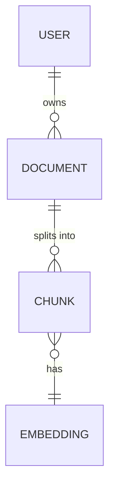

# Data Model & Capacity Canvas — `<project-name>`

> Fill BEFORE choosing the database. Forces you to think in access patterns, not tables.

## 1. Core entities

<!-- Noun per entity. Keep to the 5–10 that carry the business. -->

| Entity | One-sentence definition | Owner (bounded context) |
| ------ | ----------------------- | ----------------------- |
|        |                         |                         |
|        |                         |                         |
|        |                         |                         |

## 2. Relationships

<!-- text or Mermaid ERD — show cardinality -->

## 3. Access patterns (the part most teams skip)

<!-- For each query your app will actually run, write the pattern here. Drives index + DB choice. -->

| #   | Pattern (in plain English)            | Read / Write | Frequency | Latency budget | Consistency need     |
| --- | ------------------------------------- | ------------ | --------- | -------------- | -------------------- |
| 1   | Get user by id                        | R            | very high | <10ms p99      | strong               |
| 2   | Vector search top-k chunks per tenant | R            | high      | <200ms p95     | eventual OK          |
| 3   | Append new document + embeddings      | W            | medium    | <1s p95        | strong within tenant |

## 4. Capacity estimate

<!-- Rough math is better than no math. -->

| Dimension             | Day 1 | Year 1 | Year 2 |
| --------------------- | ----- | ------ | ------ |
| Entities (rows)       |       |        |        |
| Payload size avg      |       |        |        |
| Storage total         |       |        |        |
| Writes / sec peak     |       |        |        |
| Reads / sec peak      |       |        |        |
| Vector dims × vectors |       |        |        |

## 5. Retention & lifecycle

- Soft delete vs hard delete per entity:
- Retention windows (legal / product):
- Archival target:
- Backup cadence + RTO/RPO:

## 6. Privacy classification

| Entity / field | Class (public / internal / PII / sensitive) | Encryption at rest | Encryption in transit |
| -------------- | ------------------------------------------- | ------------------ | --------------------- |
|                |                                             |                    |                       |

## 7. Conclusion feeding the DB ADR

<!-- One paragraph: given patterns 1–3 and the capacity in section 4, the primary store should be X because Y, with Z for specialized workloads. -->
