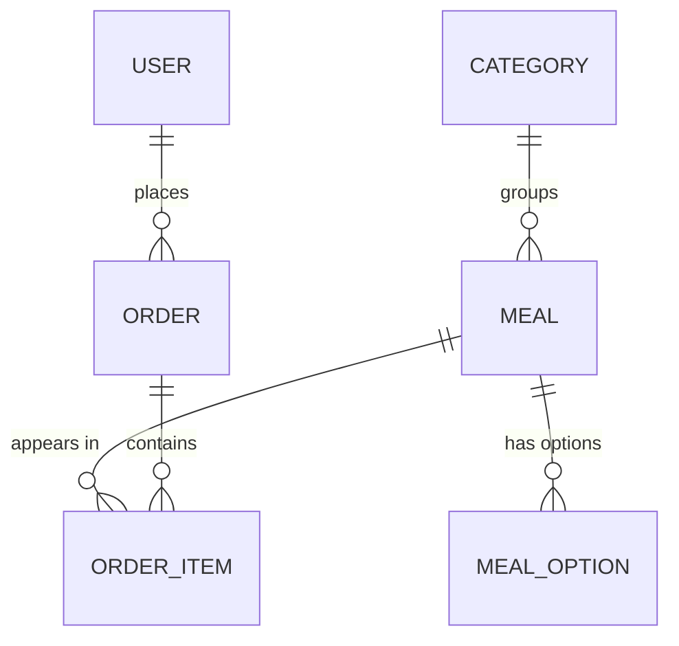

# Data Model & Capacity Canvas — `oishi-sushi`

> Fills the "think in access patterns, not tables" gap before the database ADR (0003) was written.

## 1. Core entities

| Entity       | One-sentence definition                                         | Owner (bounded context) |
| ------------ | --------------------------------------------------------------- | ----------------------- |
| `User`       | A person who can log in, either customer or admin.              | auth                    |
| `Category`   | A grouping of meals (Maki, Nigiri, Special Rolls).              | menu                    |
| `Meal`       | A sellable dish with a price, category, and optional modifiers. | menu                    |
| `MealOption` | A per-meal add-on with a price delta (extra sauce, no wasabi).  | menu                    |
| `Order`      | A customer's purchase, with status + delivery + totals.         | orders                  |
| `OrderItem`  | A line item inside an order — one meal + qty + captured price.  | orders                  |

## 2. Relationships

## 3. Access patterns (the part most teams skip)

| #   | Pattern (in plain English)                                   | Read / Write | Frequency | Latency budget | Consistency need           |
| --- | ------------------------------------------------------------ | ------------ | --------- | -------------- | -------------------------- |
| 1   | Public menu: list categories + their active meals            | R            | very high | <100ms p95     | strong                     |
| 2   | Admin meals list: list all meals incl. inactive + deleted    | R            | low       | <200ms p95     | strong                     |
| 3   | Admin create/update meal (with options FormArray)            | W            | low       | <300ms p95     | strong                     |
| 4   | Admin soft-delete meal (sets `deletedAt`)                    | W            | very low  | <300ms p95     | strong                     |
| 5   | Customer places order (order + N items, atomic)              | W            | medium    | <500ms p95     | strong, single transaction |
| 6   | Customer lists own orders, most recent first                 | R            | medium    | <150ms p95     | strong                     |
| 7   | Customer reads one order by id (own only — 403 otherwise)    | R            | medium    | <100ms p95     | strong                     |
| 8   | Admin lists orders filtered by status                        | R            | low       | <200ms p95     | strong                     |
| 9   | Admin patches order status (emits gateway event in-process)  | W            | low       | <300ms p95     | strong                     |
| 10  | Gateway resolves "is this user the order owner or an admin?" | R            | medium    | <50ms p95      | strong                     |

**Index plan derived from patterns:**

- `User.email` — `@unique` (covers login lookup).
- `Category.slug` — `@unique` (covers public category routing).
- `Meal (categoryId, active)` — `@@index` (covers pattern #1; predicate `active = true AND deletedAt IS NULL` is applied in the query).
- `Order (userId, createdAt DESC)` — `@@index` (covers pattern #6).
- `Order (status)` — `@@index` (covers pattern #8).
- `OrderItem (orderId)` — covered by the FK index Postgres auto-creates for `@relation`.

## 4. Capacity estimate

> Portfolio-scale numbers — the real metric here is "is the architecture embarrassing at 10×?" Answer: no.

| Dimension             | Day 1        | Year 1 (demo-viral) | Year 2 (real restaurant) |
| --------------------- | ------------ | ------------------- | ------------------------ |
| Users                 | 2 (seeded)   | 500                 | 5,000                    |
| Meals                 | 6 (seeded)   | 30                  | 80                       |
| Orders                | 0            | 1,000               | 50,000                   |
| Order items per order | —            | 3 avg, 10 p95       | 3 avg, 12 p95            |
| Payload size avg      | 2 KB (order) | 2 KB                | 2 KB                     |
| Storage total         | <50 MB       | <500 MB             | <5 GB                    |
| Writes / sec peak     | 0.01         | 1                   | 10                       |
| Reads / sec peak      | 1            | 20                  | 200                      |
| WS connections peak   | 1            | 20                  | 200 (lunch rush)         |

At year-2 scale, a single Postgres 16 on modest hardware is comfortable; no sharding, no read replicas, no caching layer needed. ADR-0001's "revisit at 5k concurrent WS" trigger is two orders of magnitude above any realistic target.

## 5. Retention & lifecycle

- **Users:** soft-delete only on admin request (out of MVP scope). Email is unique → can't reuse after hard-delete anyway.
- **Meals:** soft-delete via `deletedAt`. Keeps referential integrity with `OrderItem.mealId` pointing at historical meals.
- **MealOptions:** hard-deleted cascade from `Meal` (no historical significance independent of their meal).
- **Orders + OrderItems:** never deleted — kept forever for audit. Legal retention is a real-world concern we acknowledge but don't enforce in the demo.
- **Backup cadence / RTO / RPO:** N/A (demo, local compose DB). In a real deploy, nightly `pg_dump` to offsite storage; RTO 4h, RPO 24h would be table-stakes.

## 6. Privacy classification

| Entity / field            | Class (public / internal / PII / sensitive) | Encryption at rest         | Encryption in transit         |
| ------------------------- | ------------------------------------------- | -------------------------- | ----------------------------- |
| `User.email`              | PII                                         | disk-level (FS encryption) | TLS                           |
| `User.passwordHash`       | sensitive (hash, not password)              | disk-level                 | TLS                           |
| `User.firstName/lastName` | PII                                         | disk-level                 | TLS                           |
| `Order.deliveryAddress`   | PII                                         | disk-level                 | TLS                           |
| `Order.phone`             | PII                                         | disk-level                 | TLS                           |
| `Meal.*`                  | public                                      | n/a                        | TLS                           |
| `Category.*`              | public                                      | n/a                        | TLS                           |
| Session JWT (cookie)      | secret                                      | n/a (client-held)          | TLS + httpOnly + SameSite=Lax |

Demo caveat: "disk-level" here means the dev machine's FileVault — there is no application-layer field encryption in the overnight scope. A real deploy would add pgcrypto for `phone` and `deliveryAddress` if legal required it.

## 7. Conclusion feeding the DB ADR

Given ten access patterns that are all relational, a required atomic transaction on order creation (pattern #5), aggregate query needs that are shallow (list + filter + sort), and a capacity ceiling two orders of magnitude below any single-Postgres limit, the primary store should be **PostgreSQL 16** accessed through **Prisma ORM** (typed, migration-first, seedable). No specialized workloads (vector, time-series, graph) warrant a second data store. See `docs/adr/0003-database.md` for the full decision.
